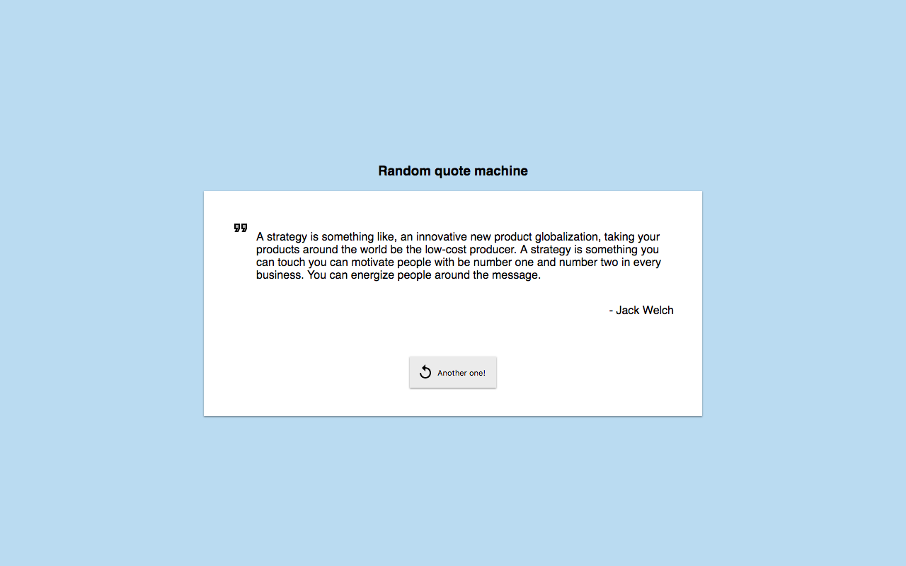

[**ReactJS-Quote-machine**](https://github.com/RisingStar-Web/react-quote-machine/)
-
This is a simple responsive random quote generator app built using ReactJS. 
[FavQs API v2](https://favqs.com/api) is used to fetch data.  
This project was bootstrapped with [Create React App](https://github.com/facebookincubator/create-react-app).

Demo
-

The app can be seen in action [here](https://react-quote-machine.surge.sh/).

**Run Locally**
-
 1.  Clone this repository and go into its src folder.
 2.  Run  `npm install`
 3.  Run  `npm start`
 4.  Go to  `http://localhost:3000`  to view the app
